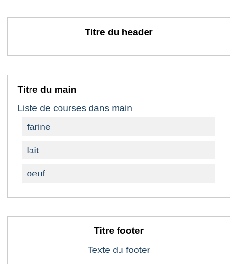

# Prendre en main le modèle React

On a commencé à jouer avec l'éco-système JS/ES6+ et avec React. `import`/`export`, premier composant React, JSX, props… c'est du sérieux !

Au quotidien avec React, nous allons utiliser pas mal d'outils pour nous aider à développer : _linter_, _bundler_, _transpiler_… des noms barbares, certes, mais ils ont un rôle fondamental : nous _faciliter_ le travail !

Il faut donc commencer par installer ces outils et se familiariser avec…

## Objectifs 

- Récupérer le modèle React complet
- Démarrer un projet avec ce modèle
- Customiser un peu son éditeur de texte
- BONUS : Un premier projet

## Etape 1 : Découvrir la structure

Le modèle React dans sa version complète, nommé `React-modèle`, est dispo sur GitHub

Clonez ce modèle dans un répertoire de travail facile d'accès. Par exemple, si vous avez une structure de dossiers comme ça :

```
├── S08
└── Spé-React
    ├── React-e01-challenge
    ├── React-e01-parcours
    └── React-e02-challenge
    └── ...
```

vous pourriez cloner le `React-modèle` _dans_ le dossier `Spé-React`, aux côtés des autres repos git de la spé, pour y avoir facilement accès de partout :wink:

Une fois le modèle cloné, ouvrez-le dans VSCode et lisez le fichier `INSTALL.md`. Explorez au fur et à mesure les différents niveaux de dossiers qui composent le modèle.

> Profitez-en pour installer les outils/extensions pour VSCode qui sont mentionnés dans `INSTALL.md` :pray:

## Etape 2 : Nouveau projet

> Le principe de ce modèle est de servir de **base** de configuration. On ne va pas travailler directement dedans, mais plutôt « copier/coller » tout ou partie du modèle, dans le dossier d'un nouveau projet.
> 
> Autrement dit, on va garder le dossier `React-modèle` intact, et dupliquer le nécessaire à chaque fois que nous en aurons besoin.

En suivant les étapes proposées dans `Comment démarrer un projet avec ce modèle` du fichier `INSTALL.md`, votre mission est de suivre les étapes proposées afin de récupérer les fichiers / dossiers depuis le modèle, pour les intégrer _ici_, dans ce challenge :slightly_smiling_face:

```bash
# Exemple : après avoir cloné un challenge quelconque dans un dossier mon-challenge/

# direction le dossier du challenge
cd mon-challenge

# copie des fichiers cachés et non-cachés présents à la racine du modèle
# note : des alertes sont affichées à propos de dossiers ignorés, c'est normal
cp -n ../React-modele/{.*,*} .

# copie (récursive) des dossiers src/, config/ et public/
# note : des alertes sont affichées à propos de dossiers ignorés, c'est normal
cp -rn ../React-modele/{src,config,public} .

# installation des dépendances listées dans le package.json
yarn

# lancement du serveur de dev
yarn start
```

## BONUS Etape 3 : Réalisation 

Après avoir récupéré ce qu'il fallait du `React-modèle` dans ce projet, et après avoir installé les dépendances JS avec `yarn`, essayez maintenant de reproduire la structure graphique ci-dessous :muscle:

> Cette maquette graphique est uniquement là comme un exemple, sentez-vous complètement libre d'imaginer autre chose :boom: Pour les styles CSS, ça se passe dans le fichier `styles.css`.



## MEGA BONUS Etape 4 : Sous-composants

Après avoir terminé l'étape 3, essayez d'enrichir le contenu de l'application en ajoutant plus de sous-composants React à `App` :thinking:
